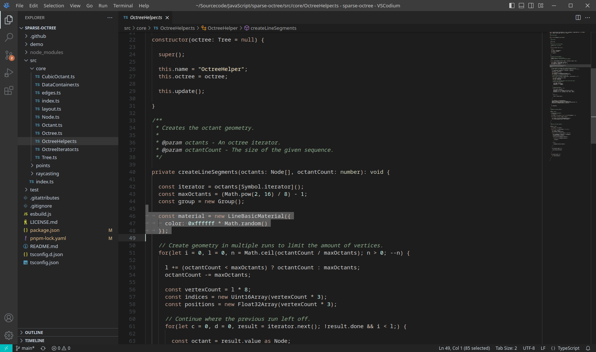
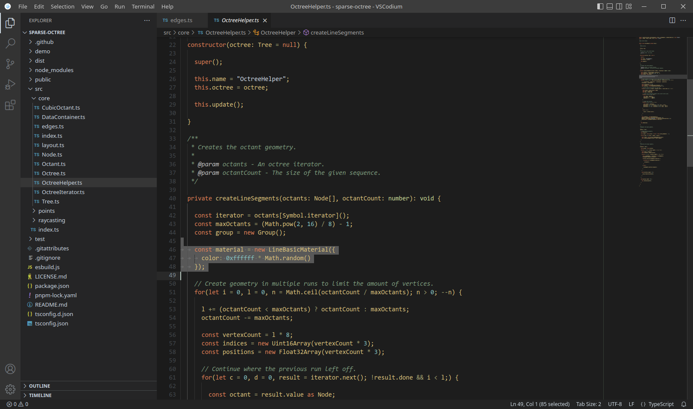

# whimsical

A color theme for VSCode, based on the Waher theme for Notepad++ by Kristo Vaher.

## Installation

```sh
npm install -g vsce

// Make the theme package
vsce package

// Install the generated package
code --install-extension <package-name>.vsix
```

## Preview




